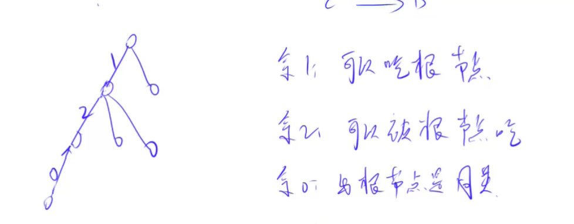

# 并查集


#### 目的

1. 快速合并两个集合
2. 查询两个元素是否在同一集合
3. 用每个集合的树状结构（父子关系、路径长等）维护结点间的某种关系

​	

（食物链用并查集路径长模3余数维护结点间关系的做法）


#### 实现


##### 存储

- 每个集合是一棵树

- 根结点存的是当前集合的编号

- **parent[i]**：下面每个结点存的是其父结点的索引，**parent[i]=j **表示第 i 个结点的父结点是第 j 个结点；根结点的 parent[i] 直接设为 i（**根结点标志：parent[i]=i**）

- **size[i]**：每个根结点的集合的元素数（只更新根结点对应的元素数，其他结点的size其实是其所在子树的结点个数）

- **初始状态**：每个结点自己是一个集合，根结点parent[i]=i

  

  ```c++
  void InitializeTrie(int n){//初始化
      for(int i=0;i<n;++i) parent[i]=i;//每个结点的父结点为自身（各自是自己集合的根结点）
      size[i]=1;//每个集合里只有一个元素（自己）
  }
  ```

  


##### 操作


###### 查询所在集合

沿着树支根据父结点一直找到根结点，即可获得集合编号

```c++
void GetSetNum(int i){//迭代法（无路径压缩）
	while(parent[i]!=i) i=parent[i];
	return i;
}
```

**优化**：在找到一个结点的根结点后，<u>直接将其一路上遇到的所有祖先结点都指向根结点</u>[**路径压缩**]（若题目要求保留合并成的树的形态，可以再开一个root数组记录各结点的根结点而不改变parent；若需要知道各结点到根结点的路径长<用数组d记录，各d在结点加入初始化为到其父结点的边长>，可在路径压缩中顺带更新路径上的各d）

```c++
int GetSetNum(int x){//返回x所在集合编号（根结点值），用递归的【路径压缩】优化
    if(parent[x]!=x){
        int t=GetSetNum(parent[x]);
        d[x]+=d[parent[x]];//顺带更新d
        parent[x]=t;
    }
    return parent[x];
}
```


###### 合并两集合

在两个树间加一条树支嫁接成一棵树（合并过程也是建树过程！）

记得判断两元素是否已在同一集合，是则不用合并，continue

```c++
void MergeSets(int x,int y){//x、y分别为两集合编号（即根结点索引）
	parent[x]=y;//或parent[y]=x;
    size[y]+=size[x];//更新嫁接后的唯一根结点的元素数
}
```

